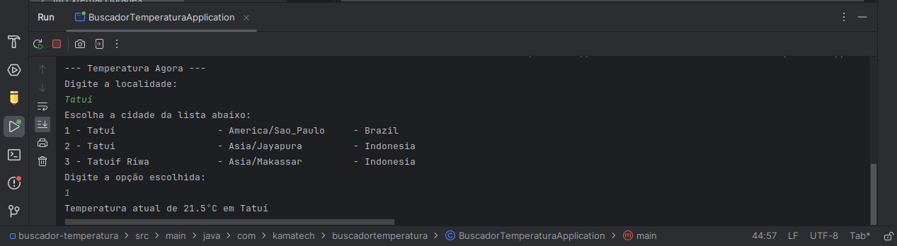

# Buscador de Temperatura Ambiente

Boas-vindas ao repositório do projeto Buscador de Temperatura

  
<strong> O que foi desenvolvido</strong>
 

Através de um consumo de API, passando como parâmetro a localidade, buscar a temperatura ambiente no momento.

É possível buscar a temperatura de qualquer local do planeta através do retorno da API Open-Meteo

Para isso primeiros buscamos pelo nome da localidade, e então encontramos a latitude e longitude do local, para então buscar a temperatura neste momento.

Etapas:
1. Buscar Localidade
2. Buscar Temperatura
3. Retornar Informações

O objetivo deste projeto é praticar a lógica de programação em um contexto de programação orientada a objetos em JAVA, 
consumindo uma API externa com RestTemplate.
É possível passar os parâmetros por protocolo http com método get nos endpoints específicos.

  
<strong> Habilidades trabalhadas</strong>

Neste projeto, foi possível:

1. Compreender os conceitos fundamentais da Programação Orientada a Objetos (POO) e como a linguagem Java aplica esses conceitos.
2. Consumir API Open-Meteo: https://open-meteo.com/
3. Preparar o backend para em um próximo passo conectar com o frontend.
4. Utilizar o Spring Boot com Maven para controle das dependências.
5. Como extra foi implementado rotina através do console, para visualizar o retorno da busca solicitada.

<strong> Como usar</strong>

Clone o projeto:    
`git clone https://github.com/fkamag/buscador-temperatura.git`

Acesse o diretório do projeto:  
`cd buscador-temperatura`

Instale as dependências:    
`mvn install`

Inicie o servidor:  
`mvn spring-boot:run`

### Para buscar a cidade
Acesse a URL    
http://localhost:8080/consulta/xxxxx    
no seu navegador web.

Substitua o `xxxxx` pelo nome da cidade que deseja saber a temperatura e pressione Enter.

Aparecerá uma lista como sugestão para a busca no formato JSON
para ser enviado ao frontend para gerar a lista.

Exemplo de uso:

Acesse a URL http://localhost:8080/consulta/Tatuí   
no seu navegador web.

Essa será a resposta:

{"results":[

{"name":"Tatuí","latitude":-23.35556,"longitude":-47.85694,"timezone":"America/Sao_Paulo","country":"Brazil"},

{"name":"Tatui","latitude":-1.85,"longitude":136.13333,"timezone":"Asia/Jayapura","country":"Indonesia"},
    
{"name":"Tatuif Riwa","latitude":-9.445,"longitude":124.81222,"timezone":"Asia/Makassar","country":"Indonesia"}

]}

### Para buscar a temperatura

Acesse a URL http://localhost:8080/tempo/xxxxx&yyyyy   
no seu navegador web.

Substitua o `xxxxx` pela latitude e o `yyyyy` pela longitude do local escolhido
e pressione Enter.

Aparecerá uma lista com alguns dados como `elevation` que é a 
altitude em relação ao nível do mar e `temperature` que é a resposta buscada.

Exemplo de uso:

Acesse a URL http://localhost:8080/tempo/-23.35556&-47.85694    
no seu navegador web.

Essa será a resposta só mudando o valor da temperatura:

{"latitude":-23.375,"longitude":-47.875,"elevation":636.0,"current_weather":{"temperature":21.5}}

Foi implementado uma funcionalidade pelo console para também ser utilizado conforme imagem a seguir:

<strong> Observações </strong>

Observações:

Este projeto é um exemplo de como utilizar a API Open-Meteo para buscar a temperatura ambiente de um local.
Você pode modificar o código para atender às suas necessidades específicas, lembrando que a API fornece uma grande
quantidade de informações sobre o local pesquisado.

Contribuições:

Sinta-se à vontade para contribuir com o projeto enviando pull requests.

Licença:

Este projeto está licenciado sob a licença MIT.

